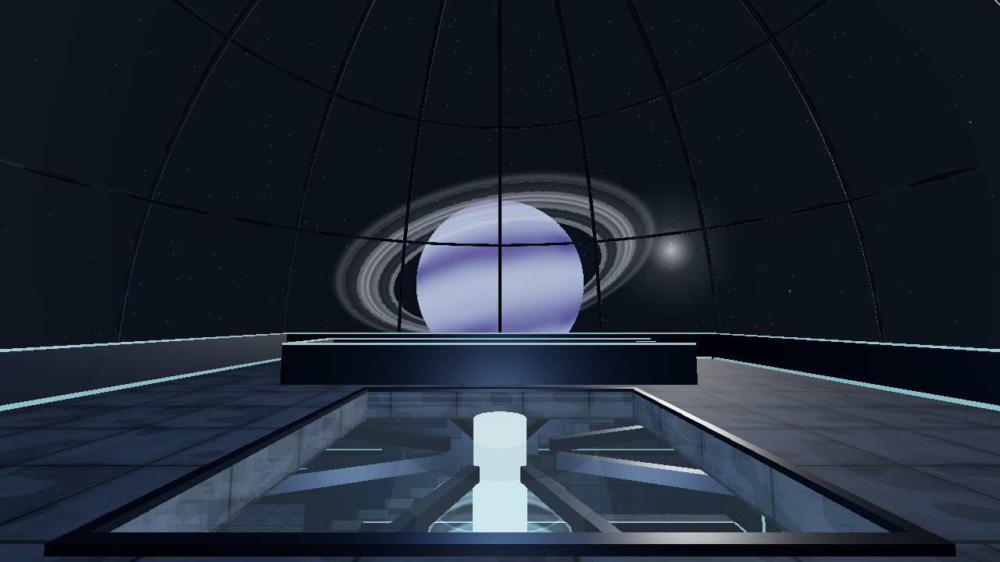
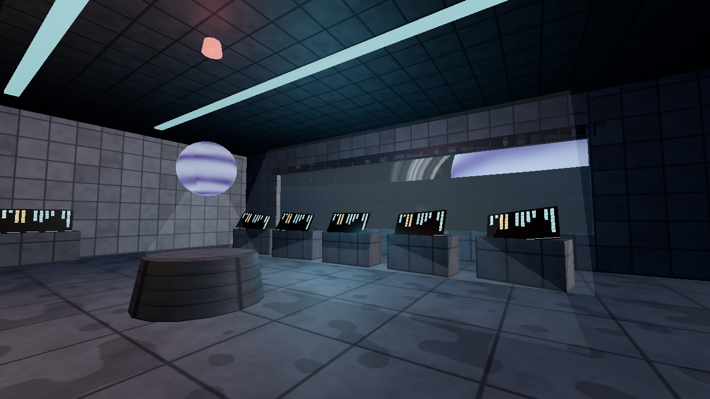
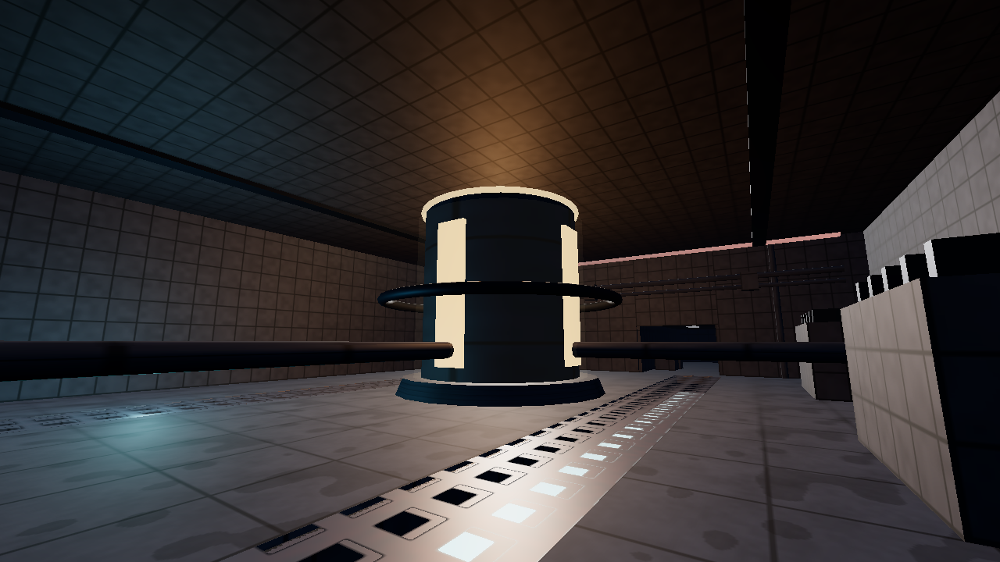
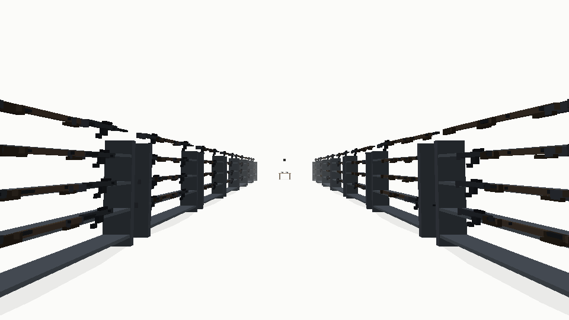
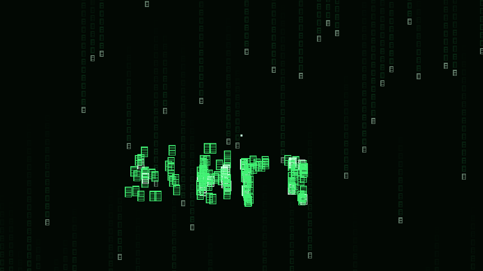
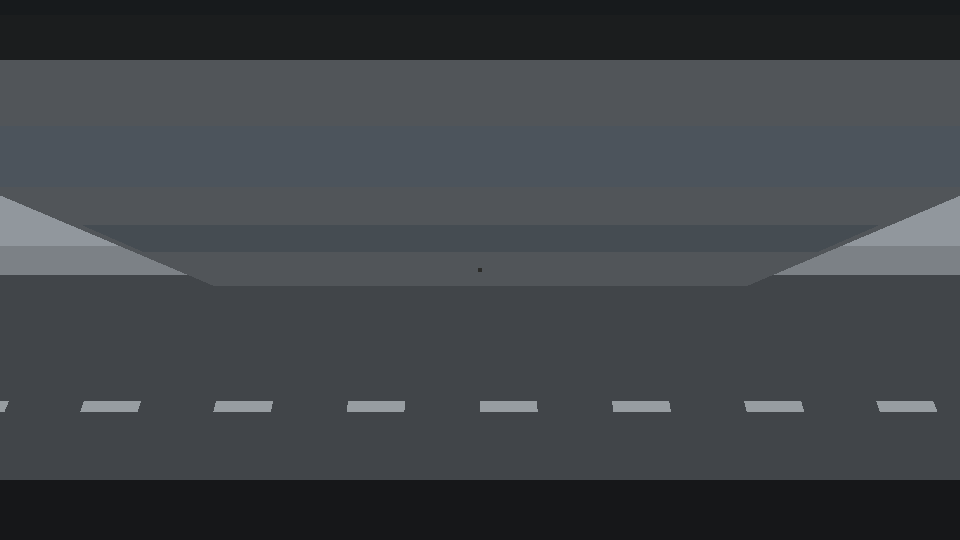
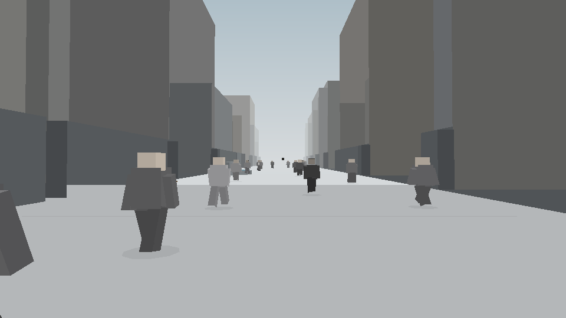
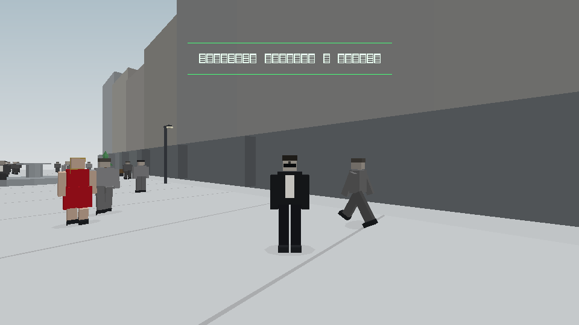

# EREBUS STATION — this branch's game

A derelict orbital station explored on foot: the rotunda, the long bridge, the reactor heart, and a sunrise through the dome. Software-rendered in the same zero-dependency engine as THE CONSTRUCT — one self-contained HTML file.

**▶ Full game & README: [`erebus-station/`](erebus-station/)**



| the bridge | the reactor |
|---|---|
|  |  |

---

# THE CONSTRUCT

A browser-playable homage to the endless white loading space from *The Matrix* (1999), built as **one self-contained HTML file** — no dependencies, no network, no build step required to play.

**▶ Play:** open [`index.html`](index.html) in any modern browser, or enable GitHub Pages on this repo (Settings → Pages → Deploy from branch → `main` / root) and play at `https://<user>.github.io/the-matrix-gameplay/`.



## What it is

You stand in a white void and ask the operator for things — by voice (hold **V**, mic permission required) or text (**Enter**). They materialize around you as green code resolving into matter:

- **"guns. lots of guns"** — fourteen weapon racks slide in from the void with motion streaks. Take a pistol from the end table (**E**) and fire it (**click**).
- **"dojo"** — a sparring room with a wing-chun dummy you can actually strike.
- **"the jump program"** — two rooftops, a 7.6 m gap, and an honest physics envelope: a full sprint clears it with a little margin; anything less does not. The **first** fall hurts — slow motion as the street rises, cracked vision, a red vignette, tinnitus, a long stagger back to your feet. Every fall after that is a white glitch and *"Again."*
- **"crowded street, lunch hour"** — ~40 suited pedestrians. There's a woman in a red dress. Staring is a lesson (once).
- **~15 props on demand** — "three chairs and a table", "a tv", "12 crates", "a phone booth" (it rings; walking in hangs you up back to white). Unknown words ("a flamingo") compile a pedestal with the letters orbiting it.
- **C** toggles **code vision**: the same scene re-rendered as falling glyphs, readable up close as the objects they encode.

| | |
|---|---|
|  |  |
|  |  |

## Controls

WASD + mouse (click to capture the cursor) · **Shift** sprint · **Space** jump · **E** use/pick up · **click** fire/strike · **C** code vision · **V** hold-to-talk · **Enter** text console · **M** mute · **H** help. Touch controls appear on mobile. If the renderer chugs, it automatically steps down resolution and crowd size.

## How it works

Zero dependencies. Everything is hand-rolled:

- **Software 3D renderer on Canvas 2D** (`src/05_engine.js`): camera transform → near-plane clip (Sutherland–Hodgman) → backface cull → painter's sort → flat shading + fog-to-white. The renderer emits a pure *draw list* of ops, which the browser paints — and which the Node harness can rasterize headlessly to PNG for visual review without a browser.
- **Procedural meshes** (`src/02_mesh.js`, `src/03_props.js`): box-people with per-vertex part IDs and pivots for a poor-man's skeletal animation (sine-driven walk cycles), props, and scenes.
- **Code vision** (`src/01_glyph.js` + engine): every mesh face is sampled into surface anchors; in code mode they render as depth-graded katakana with LOD, and within ~7 m the glyphs cycle the object's own label characters.
- **Game logic** (`src/06_game.js`): free-form request parser, per-axis AABB capsule collision, the jump envelope, the first-fall hurt sequence, the crowd + red-dress freeze lesson.
- **Audio** (`src/07_audio.js`): WebAudio synthesis (no samples) and a speechSynthesis operator voice.

## Build & test

```bash
bash build.sh            # concatenates src/ into dist/the-construct.html
node node/tests.js       # 399 assertions: parser, physics solver vs. simulation,
                         # full fail→hurt→retry→success arc, freeze lesson,
                         # collision, NaN soak (4500 frames), perf budget
node node/shots.js       # renders 21 headless PNG screenshots into shots/
```

`index.html` at the repo root is the built game (same artifact as `dist/the-construct.html`).

## Note

This is an **original-assets homage**: no film footage, music, character names, or quoted dialogue. All geometry, audio, and operator lines are original work inspired by the film's ideas.
