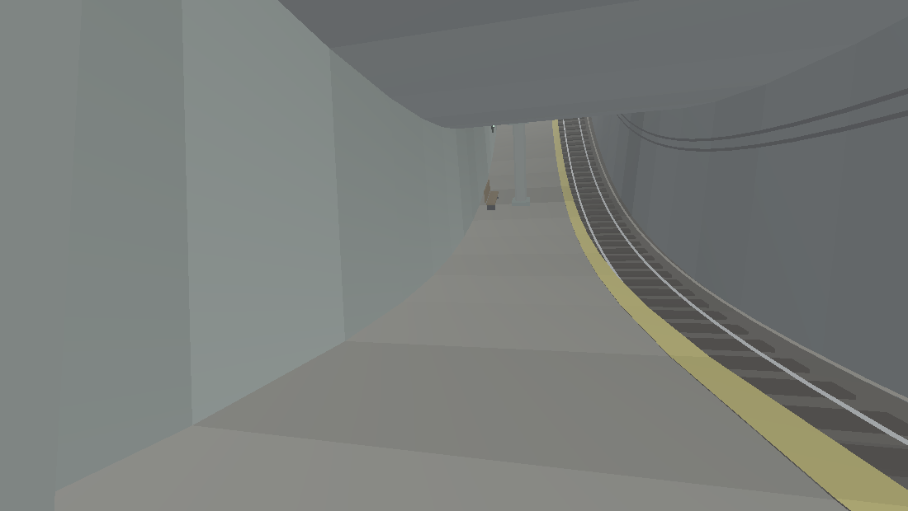
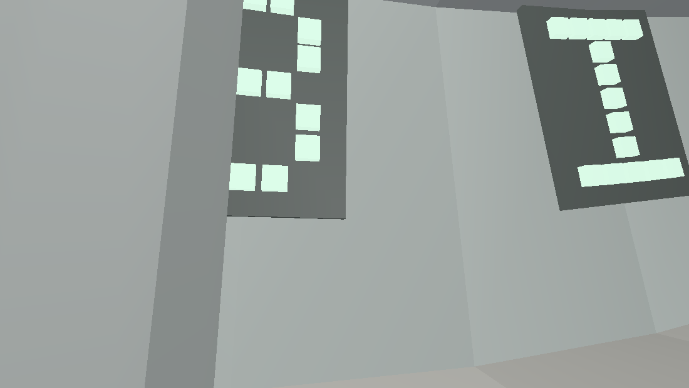
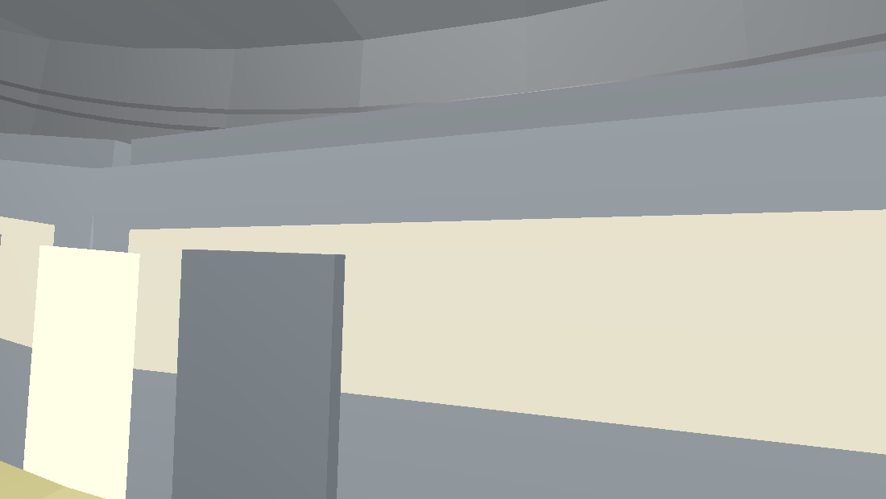

# MOBIL AVE — this branch's game

The in-between subway station from *Revolutions*: a 48-tile looping platform, the sign, the train that arrives on its own schedule. A zero-dependency tile engine (2D, fully tested) plus a 3D staging of the same world spec — and a built-in honest camera (`tools/preview3d.js`) that software-renders the very file you play.

**▶ Play (3D):** open [`web/mobil-ave-3d.html`](web/mobil-ave-3d.html) · **standalone:** [`dist/`](dist/) · **2D playthrough:** `node node/play.js`

| | |
|---|---|
|  |  |

---

# the-matrix-gameplay

Zero-dependency tile game engine. Scenes live in `construct/`; the engine,
parser, draw-list renderer, tests, and playthrough driver live in `node/`.

## Rules
- Zero dependencies. Plain Node, no packages.
- Draw-list renderer only: `buildDrawList()` emits ops, `present()` consumes
  nothing but the list.
- Scenes own their space: a scene may define `canon(x)` and `images(cx,x0,x1)`
  to identify coordinates. The engine never assumes a flat plane.
- All tests in `node/tests.js`. Baseline S1–S8 (677 assertions), Mobil Ave
  T-a–T-e appended.

## Run
    node node/tests.js    # 1172 assertions
    node node/play.js     # scripted end-to-end session -> PLAYTHROUGH.txt

## Scenes
- `void` — the white loading space. Operator requests compile: pedestal + item.
- `mobil-ave` — a between-place. Ask the operator for "the station" or
  "mobil ave". The track is a genuine cylinder: x ~ x + 48 as an identification
  of world coordinates, so you can walk the loop forever, an object dropped at
  the join is visible from both approaches, and the code-vision glyph field is
  continuous across it. MOBIL is written on the wall; read it near the sign.
  Operator requests inside sketch a pedestal that unravels — nothing
  materializes, no scene loads, no exit compiles. A train runs on its own
  timetable (period 40 ticks) and is the only way out. Board it to return to
  the void.

## 3D staging (web/)
The same world, staged in 3D as a literal ring: `web/world.js` is one pure
spec consumed by BOTH the playable page and the preview renderer.
- Play (standalone, double-clickable): `dist/mobil-ave-3d.standalone.html`
- Dev page: `web/mobil-ave-3d.html` (serve the repo root, e.g.
  `python3 -m http.server`, then open /web/mobil-ave-3d.html)
- Screenshot loop: `node tools/preview3d.js --shot vista --pass 3 --passB 2 --out cmp.png`
- Rebuild standalone: `node tools/build-artifact.js`
- Pass-by-pass visual log: `web/PASSLOG.md`

Homage note: mechanics riff on the between-station idea from The Matrix
Revolutions; all text here is original.
