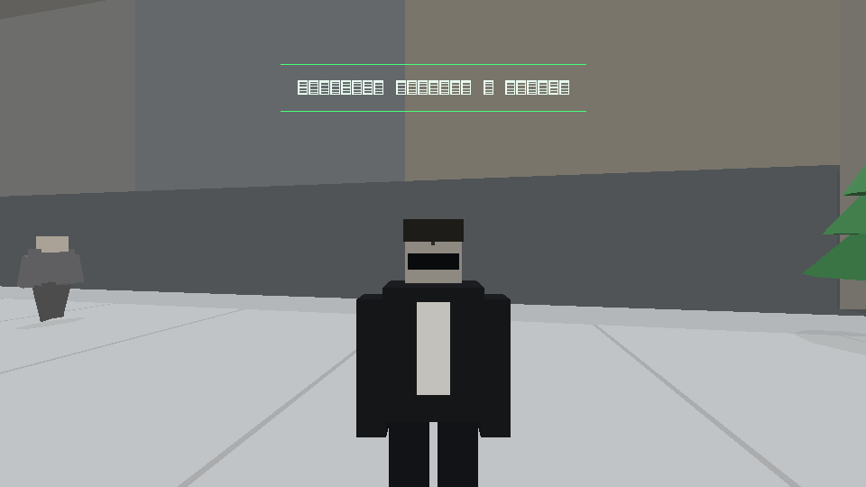
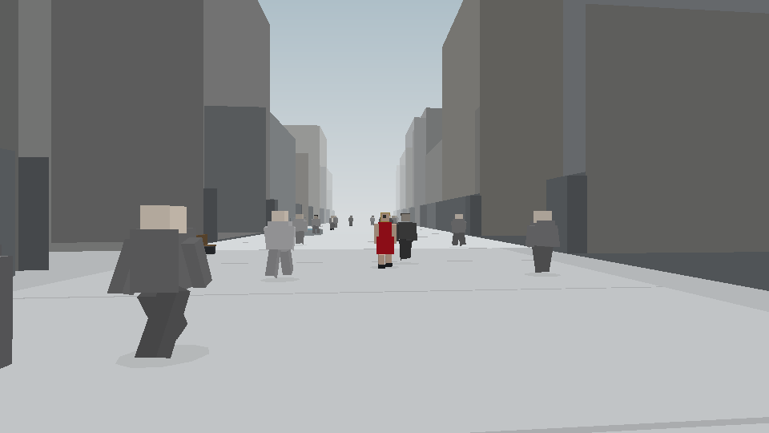

# the-matrix-gameplay

A small arcade of browser games. Each lives in its own folder and runs as a single HTML file.

## [`construct/`](construct/) — THE CONSTRUCT (déjà vu build)

A homage to the white loading space from *The Matrix* (1999). Zero dependencies, software-rendered, one HTML file. This branch carries the **déjà vu** build: stare too long in the lunch-hour crowd and the world stutters — a frozen agent, a woman in red, the same cat twice.

| the woman in red | the armory aisle |
|---|---|
|  |  |

Other games live on branches (`peach-blossom`, `orange-empire-1937`, `cyberpunk-motorcycle`) until they merge.
