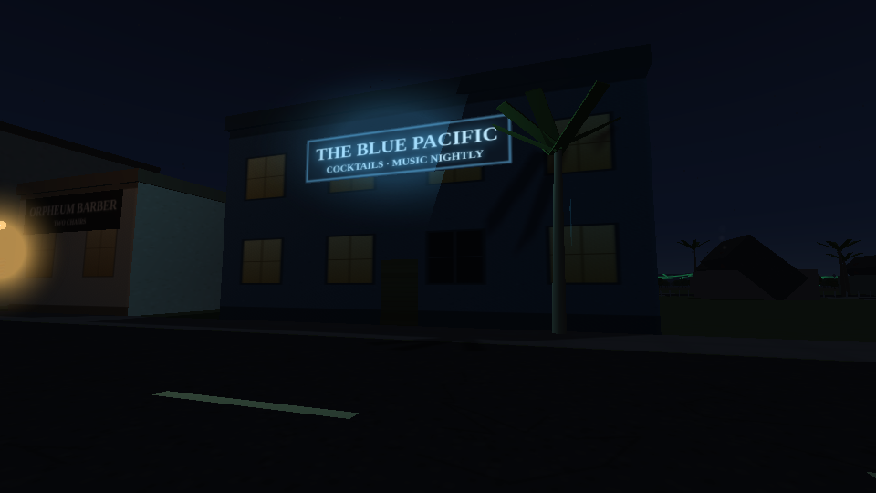
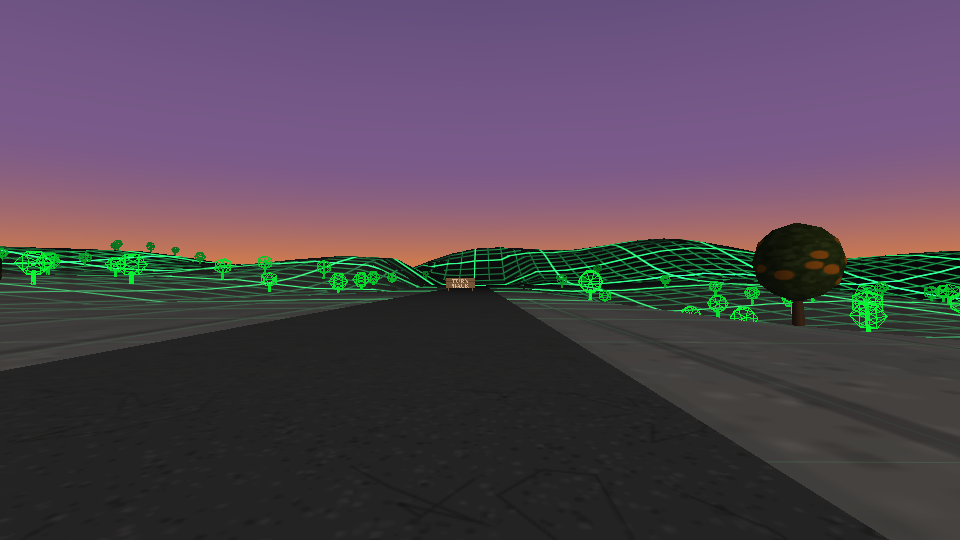

# THE ORANGE EMPIRE

Los Angeles County, Friday evening, June 11, 1937. A citrus town called Angel City, a bar called the Blue Pacific, and a road heading east that every sign says is closed. One self-contained HTML file. The only dependency is Three.js r128 from cdnjs; the buildings, the textures, the jazz, the radio, and the voices are all generated by code at load time.

**Play:** open [`index.html`](index.html) in a desktop browser (needs internet once, for the CDN). Or with GitHub Pages enabled, `https://<user>.github.io/the-matrix-gameplay/orange-empire/`.

## The game

Your objective is one line long: find a drink. The Blue Pacific is fifty meters from where you wake up. The real game starts after the drink, because the town has seams, six of them, and noticing them is what moves the story. The bartender pours your rye before you ask. The phonograph record skips on the same bar of the same song, every loop. A woman drops her oranges at the same minute past every hour. The newspaper never changes. The radio has a fourth station that only counts.

Notice three and Gus the bartender stops being polite. He hands you a matchbook for Whitmore Citrus Co., East Grove Road, and tells you about the man who sat on your stool before you. The barricades break if you hit them with speed. There is a packing shack past the first one with a loose floorboard. And at nine hundred sixty-five meters out, you find out what kind of place this is.

Both ending choices work. The game also lets you skip everything and drive east from the first minute.

## Controls

WASD moves, mouse looks, Shift runs. E does everything: talk, doors, the newspaper, getting in and out of the car. J journal, F headlights, R radio, M mute, Escape pauses. In dialogue, Space advances and digits choose. Touch controls appear automatically on phones.

Driving: W gas, S brake and reverse, A and D steer.

## Building

`node build.js` concatenates `src/*.js` in order into `dist/bundle.js` and wraps it in `dist/index.html`. The committed `index.html` here is that output. No bundler, no transpiler.

The source is sixteen modules behind one UMD wrapper: config and state, utilities, procedural textures, shader materials, the town, the groves and the boundary, vehicles, NPCs, the bar interior, the player, dialogue trees, quest and seam logic, the edge-of-world systems, audio synthesis, the DOM UI, and the boot loop. In a browser it boots itself; in node the factory exports for testing.

## Testing

The game was built and verified without ever opening a browser. Four suites, 141 assertions:

`npm test` runs logic (clock, terrain parity, collision, dialogue, seam triggers), a full playthrough bot that finishes the entire story through both endings and the loop reset using only simulated input, a jsdom pass over every screen and menu, and an audio suite that renders footsteps through an offline WebAudio context and inspects the waveform for clicks, clipping, and stride cadence.

`npm run shots` renders a 14-pose screenshot tour headlessly (needs `xvfb-run` and the `gl` package). The images in `shots/` came from it.

## Notes

Three.js is pinned to r128 to match the CDN build, so no CapsuleGeometry and no OrbitControls. No localStorage. World scale is meters; one game minute passes every two real seconds, starting at 7:24 PM. The seed is 19370611.
