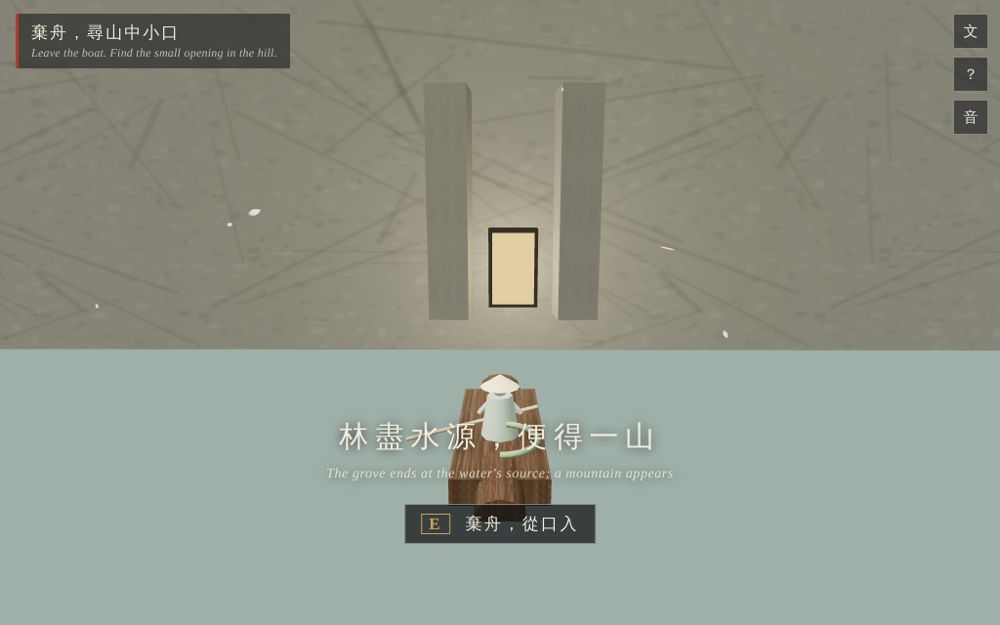
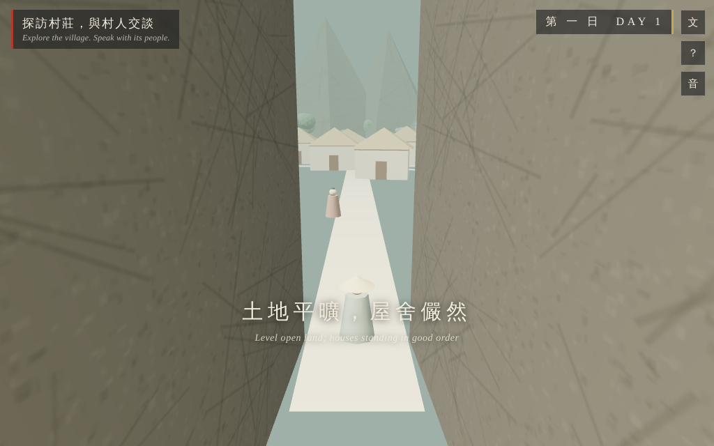

# 桃花源記 · THE PEACH BLOSSOM SPRING

Jin dynasty, the Taiyuan years. A fisherman from Wuling rows up a stream he knows until peach blossom closes over both banks and he stops knowing it. Tao Yuanming wrote the story around the year 421; this is that story as a small game, played from the boat. One self-contained HTML file. The only dependency is Three.js r128 from cdnjs; the river, the grove, the village, the people, and the music are all generated by code at load time.

**Play:** open [`index.html`](index.html) in a browser (needs internet once, for the CDN). Or with GitHub Pages enabled, `https://<user>.github.io/the-matrix-gameplay/peach-blossom/`.



## The game

Row upstream with W until the ordinary forest gives way to pure peach blossom. 中無雜樹, not one stray tree, and the test harness counts every trunk in the grove to hold the game to it. Where the grove ends at the water's source there is a mountain, and in the mountain a small opening with light faintly showing through. Leave the boat, squeeze in, and the crevice opens onto level fields and quiet houses: 豁然開朗.

The villagers' ancestors fled the wars of Qin five centuries back. They have never heard of the Han, let alone Wei or Jin. Talk with all of them (E), stay for the days of feasting, then take your leave. They ask one thing of you: 不足為外人道也. Say nothing outside.

You mark the route anyway, cut by cut, all the way home (處處誌之), and you tell the prefect. Leading his men back upstream to find the marks gone is the part Tao Yuanming is still read for.



Tap 原文 on the title screen to read the original text beside an English rendering; each line also surfaces in play at the moment it describes.

## Controls

W/S or the arrow keys to row and to walk, A/D to steer, E to talk, to leave the boat, and to cut marks.

## Build and test

`node build.js` concatenates `src/` into the playable `index.html` (CDN Three.js) plus a test build with Three.js inlined for sandboxed headless runs.

`test/harness.js` plays the entire game in headless Chromium: 80 checkpoints across every phase, dialogue, day, and mark. Motion is verified empirically rather than by eye, with facing-versus-velocity and camera-follow dot products in all four movement modes, and the cliff light is checked at the pixel level. A still of a river looks plausible facing either way; this harness exists because of that.

```
npm install
node build.js
node test/harness.js
```
